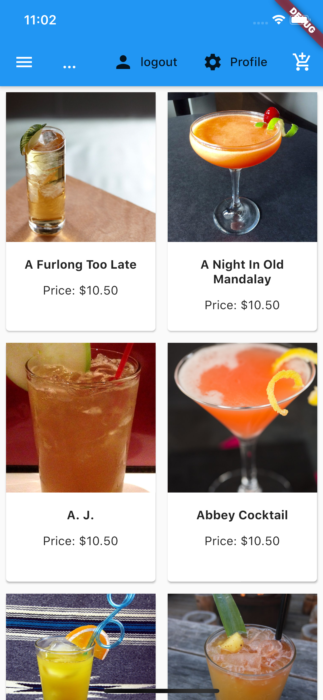

# RestaurantsApp

## Description 

This project is developed to be showcased to clients. The app is in house app for a resturant that will show menu, take reservation and make reservation.


## Installation 

### Download 

```bash
git clone https://github.com/Jagateesvaran/RestaurantsApp.git
```

### Change directory 

```bash
cd restaurantsapp
```

### Upgarde flutter

```bash
flutter upgrade 
```

### Get all package

```bash
flutter pub get
```

### See the devices you want to run in

```
flutter devices 
```

### Run the project

```
flutter run -d {device id}
```


## Usage

|  | The is the login page, you can use the default password. Email: user@gmail.com and Password: 1234567890. |
| ------------------------------------------------------------ | ------------------------------------------------------------ |
|  | You can Register an account with the app if you wish.        |
|  | This is the main menu where you can add drinks into the cart by tapping on it. |


https://github-readme-stats.vercel.app/api?username=AppDevIn&&show_icons=true&title_color=ffffff&icon_color=bb2acf&text_color=daf7dc&bg_color=151515

